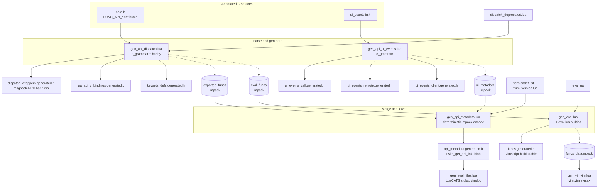

Yes — the contract is split between what `c_grammar.lua` *parses* and what the generators *enforce*. Pulling it all together from the dump, here is the full set of rules a C function must follow to participate in the machinery.

## 1. `FUNC_API_*` attribute macros (after the parameter list, before `{` or `;`)

These are no-op macros to the C compiler; the grammar captures them as flags on the prototype:

| Macro | Effect in the generators |
|---|---|
| `FUNC_API_SINCE(n)` | API level the function appeared in. **Mandatory** for every exported `nvim_*` function and every UI event — `gen_api_dispatch` and `gen_api_ui_events` both hard-fail the build (`os.exit(1)`) with "lacks since field" if it's missing. Exempt: `nvim__*` (gets `since = -1`), `nvim_error_event`, and UI events starting with `_`. |
| `FUNC_API_DEPRECATED_SINCE(n)` | Marks deprecated; also makes a non-`nvim_`-prefixed function exportable (the `public` test is `startswith('nvim_') or deprecated_since`). |
| `FUNC_API_FAST` | Handler may run during `event_poll` / in contexts where deferral isn't needed. In the Lua bindings, non-fast functions get the `nlua_is_deferred_safe()` guard (`e_fast_api_disabled`); fast ones skip it. Also emitted into `method_handlers[].fast`. |
| `FUNC_API_TEXTLOCK` | Generates a `text_locked()` check that raises `kErrorTypeException` with `get_text_locked_msg()` before the call, in both RPC and Lua wrappers. |
| `FUNC_API_RET_ALLOC` | Return value is heap-allocated by the callee; Lua wrapper emits `api_free_<type>(ret)` after pushing, and `method_handlers[].ret_alloc = true`. |
| `FUNC_API_NOEXPORT` | Parsed but excluded from dispatch/metadata entirely. |
| `FUNC_API_REMOTE_ONLY` | RPC channel only — no Lua binding, no vimscript shim (`f.remote = true, f.lua = false, f.eval = false`). |
| `FUNC_API_LUA_ONLY` | Inverse: Lua binding only, no RPC handler, no eval shim. |
| `FUNC_API_REMOTE_IMPL` | (UI events) a hand-written `remote_ui_*` implementation exists; don't generate one. |
| `FUNC_API_COMPOSITOR_IMPL` | (UI events) compositor provides its own implementation; the generated `ui_call_*` routes through `!ui->composed` / `ui->composed` variants. |
| `FUNC_API_CLIENT_IMPL` | (UI events) hand-written `ui_client_event_*` exists; skip generating it (but still register it in the client handler table). |
| `FUNC_API_CLIENT_IGNORE` | (UI events) omit from the client dispatch table entirely. |

Catch-all rule in the grammar: any other `FUNC_*` token (with optional parenthesized args) — e.g. `FUNC_ATTR_NONNULL_ALL`, `FUNC_ATTR_CONST` — is matched and **discarded**. So compiler-attribute macros must start with `FUNC_` to be tolerated in the attribute position; anything else there breaks the prototype match and the function silently vanishes.

## 2. Magic parameters (recognized by *name/type + position*, then stripped)

`gen_api_dispatch.add_function` performs positional surgery — these are conventions, not macros:

- `uint64_t channel_id` as the **first** parameter → wrapper passes the real channel id (RPC) or `LUA_INTERNAL_CALL` (Lua); the parameter disappears from the client-visible signature.
- `Array uidata` as the **second** parameter → function receives the raw args array itself (`receives_array_args`).
- `Error *err` as the **last** parameter → `can_fail`; the wrapper passes a local `Error`, checks `ERROR_SET`, and converts to msgpack error / `lua_error`. Clients never see it.
- `Arena *arena` as the last (after `Error` removal) → wrapper passes its local arena for return-value allocation.
- `lua_State *lstate` as the last → `has_lua_imp`: the function pushes its own return value onto the Lua stack (RPC path passes `NULL`). The generated wrapper *asserts* exactly one value was pushed — unless the function is in the hard-coded `lua_retstack` exemption list (`nvim_buf_call`, `nvim_win_call`).

Order matters because the checks pop from the tail one at a time; the effective canonical tail is `..., Arena *arena, lua_State *lstate, Error *err` being consumed right-to-left as `err`, then `lstate`, then `arena`.

## 3. Naming and type-language rules

- Export requires the `nvim_` prefix (or a deprecated-since attribute). `nvim_buf_*` / `nvim_win_*` / `nvim_tabpage_*` prefixes automatically mark the function as a **method** in metadata (dispatchable on the object). `nvim__*` means private/unstable: exported but `since = -1` and excluded from the public metadata blob.
- Parameter and return types must come from the API type vocabulary — `Boolean`, `Integer`, `Float`, `String`, `Array`, `Dict`, `Object`, `Buffer`, `Window`, `Tabpage`, `LuaRef` — or the parameterized containers parsed by `typed_container`: `ArrayOf(T[, n])`, `DictOf(T)`, `Dict(name)`, `DictAs(name)`, `Union(...)`, `Tuple(...)`, `Enum("a","b")`, `LuaRefOf((args)[, ret])`, with optional leading `*` meaning optional. Note these are *type-position macros* that also expand to something the C compiler accepts; the generator re-parses them from the token text.
- Generated coercions you get for free (so don't hand-roll them): Buffer/Window/Tabpage accept nonnegative Integers; Float accepts Integer; `Dict`-typed params accept an empty Array (empty Lua table); `Dict(name)` params accept `{}`.
- `lint.lua` additionally bans nouns in names/parameters per `:help dev-name-common` (`buffer`→`buf` etc.) for the doc pipeline.

## 4. Keysets

A `typedef struct { ... } Dict(name);` in an API header is parsed by the `keyset` rule and generates a `KeySetLink` table + perfect-hash `_get_field` lookup. Field rules enforced with hard errors in `add_keyset`: if optional-key tracking is wanted, the **first** field must be named exactly `is_set__<name>_` with type `OptionalKeys`; a field may carry `DictKey(actual_key)` when the wire key differs from the C member name; `Object`-typed fields get no type constraint in the table.

## 5. Declaration and doc conventions (the other two consumers)

`gen_declarations.lua` parses *every* function definition in every TU to emit prototypes — which is why nvim C code never writes forward declarations by hand, and why definitions must stay within the grammar's parsable subset (the modifiers it knows are `static`, `inline`/`__inline`, `DLLEXPORT`; `typedef` lines are explicitly excluded). `///` comments immediately above a prototype are captured by `cdoc_parser` for vimdoc/metadata — separated from the previous item by a truly blank line, per the `nl * nl` rule we discussed in the first message.

The enforcement asymmetry is worth restating: missing `since`, malformed keysets, and deprecated-alias collisions are **loud** (build aborts with a message). But a definition that drifts outside the grammar's subset — an unrecognized attribute macro not starting with `FUNC_`, a type spelled outside the vocabulary — fails **silently**: the prototype falls through to `ignore_line` and the function simply doesn't exist as far as dispatch, declarations, or docs are concerned. The first symptom is usually a linker error (missing prototype) or an API method that mysteriously isn't there. That's the sharp edge to remember when writing new API functions.

